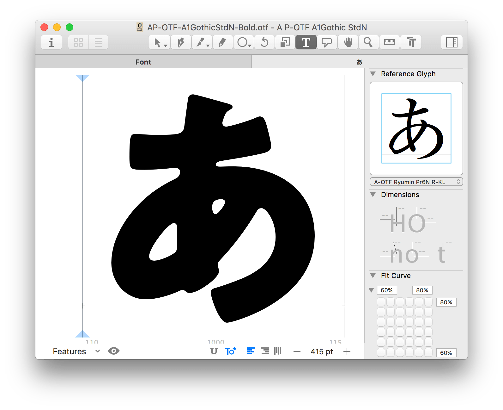

# ReferenceGlyph.glyphsPalette

A Glyphs plugin that shows a reference glyph from the installed fonts in the palette.

## Installation

1. Download the ZIP archive and unpack it, or clone the repository.
2. Double-click the `.glyphsPalette` in the Finder. Confirm the dialog that appears in Glyphs.
3. Restart Glyphs.

## Notes

* The reference glyph will be resolved by the codepoint if the selected glyph is encoded.
* It tries to find a glyph by CID only when the selected glyph name has the format like `cid00843`. Make sure the reference font is CID-keyed and has an identical ROS on both sides to display the glyph in question correctly.
* Note that alternates glyphs cannot be shown unless the production names match to the others.

## Requirements

Tested with Glyphs 2.3 on OS X 10.11. Also supports Glyphs 3.

## License

TBD
